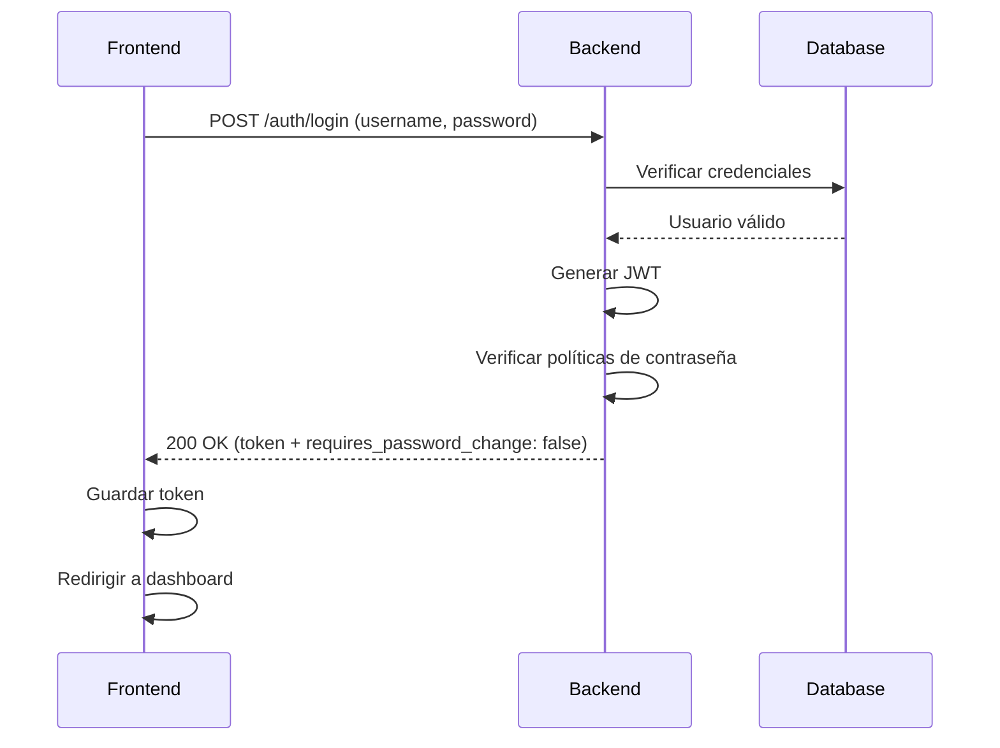
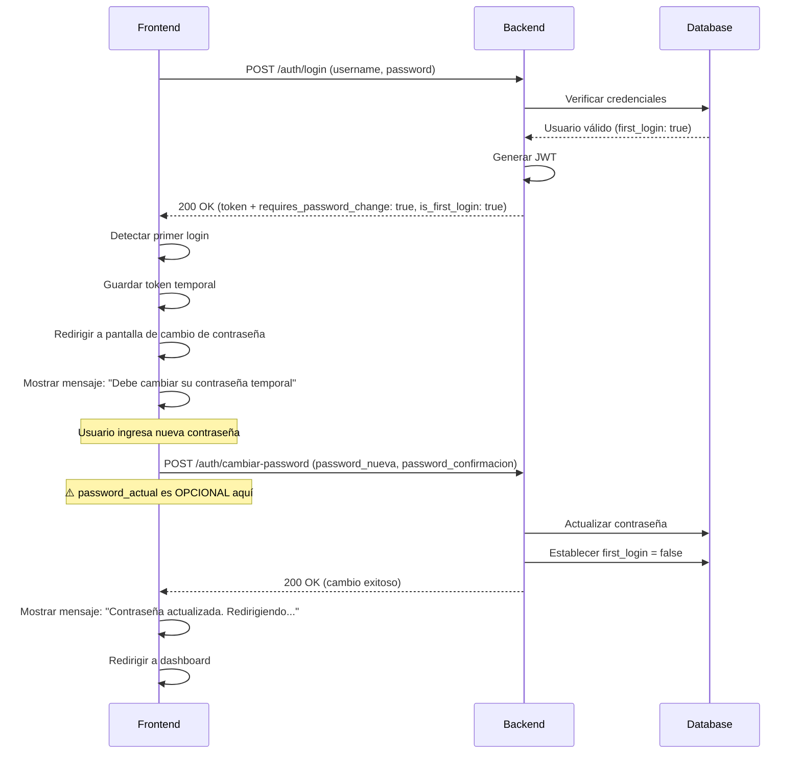
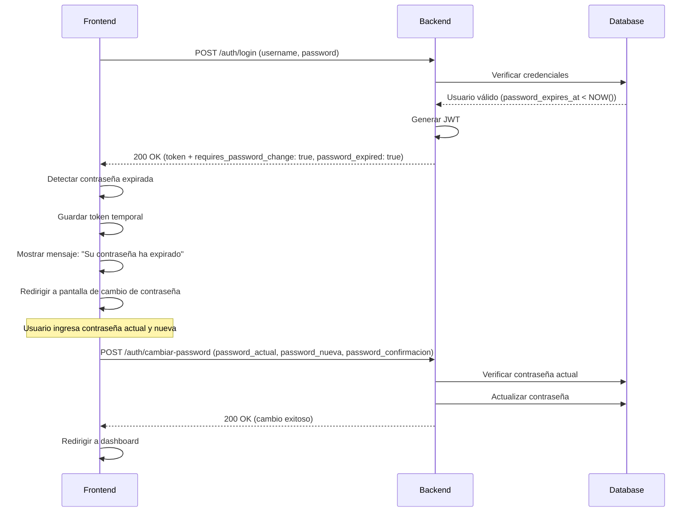
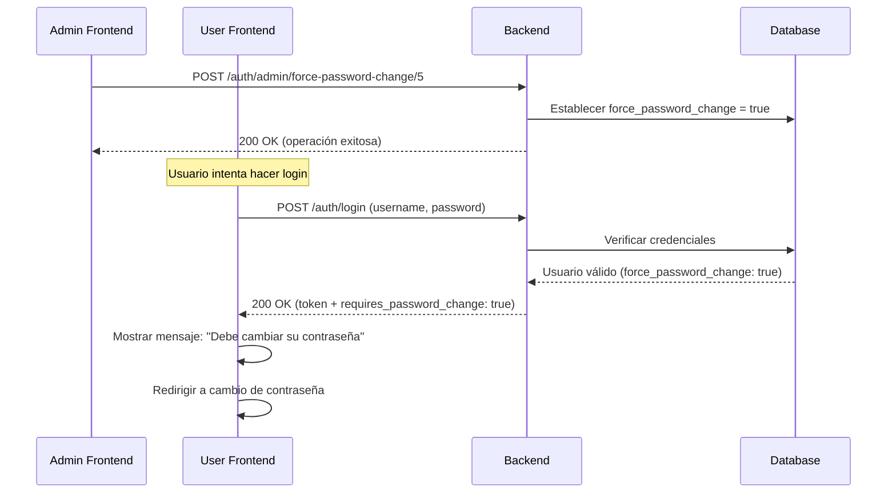
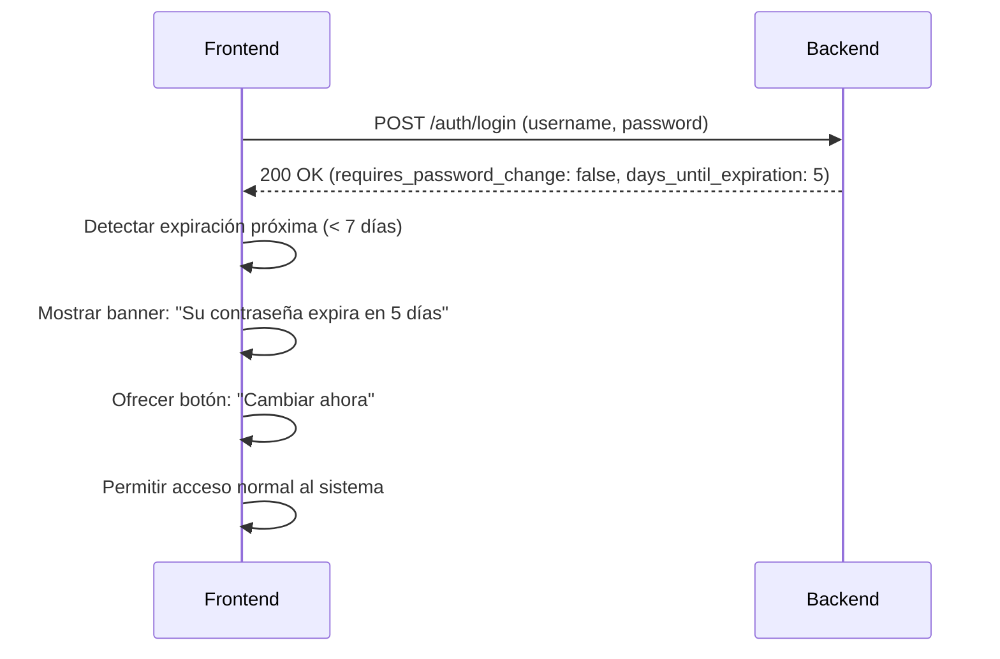

# 📋 API Contract - Módulo de Autenticación

**Versión:** 2.0  
**Fecha:** 8 de febrero de 2026  
**Equipo Backend:** API Clientes Autenticada  
**Propósito:** Contrato de integración para equipos Frontend/Mobile  

---

## 📌 Información General

Este documento define el **contrato de interfaz** entre el Backend y Frontend para el módulo de autenticación y gestión de usuarios. Especifica los esquemas de datos, validaciones, flujos de trabajo y códigos de respuesta que el backend implementa y que el frontend debe cumplir.

### Características Principales

- ✅ Autenticación basada en **JWT (Bearer Token)**
- ✅ **Políticas de contraseñas** avanzadas
- ✅ **Primer login obligatorio** con cambio de contraseña
- ✅ **Expiración de contraseñas** (90 días)
- ✅ **Cambio forzado** de contraseña por administrador
- ✅ **Sistema de roles** (admin, user, guest)
- ✅ **Validación de fortaleza** de contraseñas

### Configuración del Backend

- **URL Base:** `http://localhost:8000` (desarrollo)
- **URL Base:** `https://api.tudominio.com` (producción)
- **Formato de respuestas:** JSON
- **Charset:** UTF-8
- **Timeout recomendado:** 30 segundos

---

## 📦 Modelos de Datos (Schemas)

### 1. LoginRequest

**Descripción:** Datos requeridos para iniciar sesión.

```typescript
interface LoginRequest {
  username: string;  // Nombre de usuario
  password: string;  // Contraseña en texto plano
}
```

**Formato HTTP:** `application/x-www-form-urlencoded`

**Validaciones:**
| Campo | Tipo | Requerido | Restricciones |
|-------|------|-----------|---------------|
| `username` | string | ✅ Sí | - No vacío<br>- Máximo 50 caracteres |
| `password` | string | ✅ Sí | - No vacío<br>- Mínimo 6 caracteres |

**Ejemplo:**
```
username=admin&password=admin123
```

---

### 2. TokenResponse

**Descripción:** Respuesta exitosa del login con información del usuario y estado de seguridad.

```typescript
interface TokenResponse {
  access_token: string;              // JWT Token
  token_type: string;                // Siempre "bearer"
  username: string;                  // Nombre de usuario
  rol: string;                       // Rol del usuario: "admin" | "user" | "guest"
  
  // 🔐 Políticas de Contraseñas
  requires_password_change: boolean; // true = debe cambiar contraseña
  password_expired: boolean;         // true = contraseña expirada
  is_first_login: boolean;          // true = primer inicio de sesión
  days_until_expiration: number | null; // Días restantes antes de expirar (null si no aplica)
}
```

**Validaciones de Campos:**
| Campo | Tipo | Siempre presente | Valores posibles |
|-------|------|------------------|------------------|
| `access_token` | string | ✅ Sí | JWT válido (formato estándar) |
| `token_type` | string | ✅ Sí | `"bearer"` |
| `username` | string | ✅ Sí | String no vacío |
| `rol` | string | ✅ Sí | `"admin"` \| `"user"` \| `"guest"` |
| `requires_password_change` | boolean | ✅ Sí | `true` \| `false` |
| `password_expired` | boolean | ✅ Sí | `true` \| `false` |
| `is_first_login` | boolean | ✅ Sí | `true` \| `false` |
| `days_until_expiration` | number \| null | ✅ Sí | `null` o número >= 0 |

**Ejemplo:**
```json
{
  "access_token": "eyJhbGciOiJIUzI1NiIsInR5cCI6IkpXVCJ9...",
  "token_type": "bearer",
  "username": "admin",
  "rol": "admin",
  "requires_password_change": false,
  "password_expired": false,
  "is_first_login": false,
  "days_until_expiration": 85
}
```

---

### 3. ChangePasswordRequest

**Descripción:** Datos requeridos para cambiar la contraseña del usuario autenticado.

```typescript
interface ChangePasswordRequest {
  password_actual?: string;      // Contraseña actual (OPCIONAL en primer login)
  password_nueva: string;        // Nueva contraseña
  password_confirmacion: string; // Confirmación de nueva contraseña
}
```

**Validaciones:**
| Campo | Tipo | Requerido | Restricciones |
|-------|------|-----------|---------------|
| `password_actual` | string | ⚠️ Condicional | - **OPCIONAL** si `is_first_login = true`<br>- **OBLIGATORIO** si `is_first_login = false`<br>- Mínimo 6 caracteres |
| `password_nueva` | string | ✅ Sí | - Mínimo 8 caracteres<br>- Al menos 1 mayúscula<br>- Al menos 1 minúscula<br>- Al menos 1 número<br>- Debe ser diferente a `password_actual` |
| `password_confirmacion` | string | ✅ Sí | - Debe ser idéntico a `password_nueva` |

**Ejemplo 1: Primer Login**
```json
{
  "password_nueva": "NuevaPass123",
  "password_confirmacion": "NuevaPass123"
}
```

**Ejemplo 2: Cambio Normal**
```json
{
  "password_actual": "MiPassActual123",
  "password_nueva": "NuevaPass456",
  "password_confirmacion": "NuevaPass456"
}
```

---

### 4. ChangePasswordResponse

**Descripción:** Respuesta exitosa tras cambiar la contraseña.

```typescript
interface ChangePasswordResponse {
  mensaje: string;            // Mensaje de confirmación
  username: string;           // Usuario que cambió su contraseña
  password_changed_at: string; // Timestamp ISO 8601 del cambio
}
```

**Ejemplo:**
```json
{
  "mensaje": "Contraseña actualizada exitosamente",
  "username": "admin",
  "password_changed_at": "2026-02-08T14:30:45.123456"
}
```

---

### 5. ErrorResponse

**Descripción:** Formato estándar de errores.

```typescript
interface ErrorResponse {
  detail: string | ValidationError[];
}

interface ValidationError {
  loc: string[];     // Ubicación del error (ej: ["body", "password_nueva"])
  msg: string;       // Mensaje de error
  type: string;      // Tipo de error
}
```

**Ejemplo Error Simple:**
```json
{
  "detail": "Credenciales inválidas"
}
```

**Ejemplo Error de Validación:**
```json
{
  "detail": [
    {
      "loc": ["body", "password_nueva"],
      "msg": "ensure this value has at least 8 characters",
      "type": "value_error.any_str.min_length"
    }
  ]
}
```

---

## 🔌 Endpoints

### 1. POST /auth/login

**Descripción:** Autentica un usuario y devuelve un JWT Token con información de sesión.

#### Request

**URL:** `POST /auth/login`

**Headers:**
```
Content-Type: application/x-www-form-urlencoded
```

**Body:** 
```
username=admin&password=admin123
```

**Formato cURL:**
```bash
curl -X POST "http://localhost:8000/auth/login" \
  -H "Content-Type: application/x-www-form-urlencoded" \
  -d "username=admin&password=admin123"
```

#### Respuestas

##### ✅ 200 OK - Login Exitoso

**Schema:** `TokenResponse`

**Escenario 1: Usuario normal sin problemas**
```json
{
  "access_token": "eyJhbGciOiJIUzI1NiIsInR5cCI6IkpXVCJ9...",
  "token_type": "bearer",
  "username": "usuario",
  "rol": "user",
  "requires_password_change": false,
  "password_expired": false,
  "is_first_login": false,
  "days_until_expiration": 75
}
```

**Escenario 2: Primer login - Requiere cambio de contraseña**
```json
{
  "access_token": "eyJhbGciOiJIUzI1NiIsInR5cCI6IkpXVCJ9...",
  "token_type": "bearer",
  "username": "nuevousuario",
  "rol": "user",
  "requires_password_change": true,    // ⚠️ IMPORTANTE
  "password_expired": false,
  "is_first_login": true,              // ⚠️ IMPORTANTE
  "days_until_expiration": null
}
```

**Escenario 3: Contraseña expirada**
```json
{
  "access_token": "eyJhbGciOiJIUzI1NiIsInR5cCI6IkpXVCJ9...",
  "token_type": "bearer",
  "username": "veterano",
  "rol": "user",
  "requires_password_change": true,    // ⚠️ IMPORTANTE
  "password_expired": true,            // ⚠️ IMPORTANTE
  "is_first_login": false,
  "days_until_expiration": -5
}
```

**Escenario 4: Cambio forzado por admin**
```json
{
  "access_token": "eyJhbGciOiJIUzI1NiIsInR5cCI6IkpXVCJ9...",
  "token_type": "bearer",
  "username": "usuario",
  "rol": "user",
  "requires_password_change": true,    // ⚠️ IMPORTANTE
  "password_expired": false,
  "is_first_login": false,
  "days_until_expiration": 60
}
```

##### ❌ 401 Unauthorized - Credenciales Inválidas

```json
{
  "detail": "Credenciales inválidas"
}
```

**Causas:**
- Usuario no existe
- Contraseña incorrecta

##### ❌ 403 Forbidden - Usuario Inactivo

```json
{
  "detail": "Usuario inactivo. Contacte al administrador"
}
```

**Causa:**
- Campo `activo = false` en la base de datos

##### ❌ 422 Unprocessable Entity - Validación Fallida

```json
{
  "detail": [
    {
      "loc": ["body", "username"],
      "msg": "field required",
      "type": "value_error.missing"
    }
  ]
}
```

**Causas:**
- Falta campo `username` o `password`
- Formato de datos incorrecto

---

### 2. POST /auth/cambiar-password

**Descripción:** Permite al usuario autenticado cambiar su propia contraseña.

#### Request

**URL:** `POST /auth/cambiar-password`

**Headers:**
```
Authorization: Bearer {access_token}
Content-Type: application/json
```

**Body Ejemplo 1 - Primer Login:**
```json
{
  "password_nueva": "NuevaPass123",
  "password_confirmacion": "NuevaPass123"
}
```

**Body Ejemplo 2 - Cambio Normal:**
```json
{
  "password_actual": "MiPassActual456",
  "password_nueva": "NuevaPass789",
  "password_confirmacion": "NuevaPass789"
}
```

**Formato cURL:**
```bash
curl -X POST "http://localhost:8000/auth/cambiar-password" \
  -H "Authorization: Bearer {token}" \
  -H "Content-Type: application/json" \
  -d '{
    "password_actual": "MiPassActual456",
    "password_nueva": "NuevaPass789",
    "password_confirmacion": "NuevaPass789"
  }'
```

#### Respuestas

##### ✅ 200 OK - Cambio Exitoso

**Schema:** `ChangePasswordResponse`

```json
{
  "mensaje": "Contraseña actualizada exitosamente",
  "username": "admin",
  "password_changed_at": "2026-02-08T14:30:45.123456"
}
```

**Efectos secundarios:**
- Se actualiza `password_hash` en la base de datos
- Se establece `first_login = false`
- Se establece `force_password_change = false`
- Se establece `password_expires_at = NOW() + 90 días`
- Se registra `password_changed_at = NOW()`
- Se guarda `last_password_change_ip` con la IP del cliente

##### ❌ 400 Bad Request - Error de Validación

**Caso 1: Contraseñas no coinciden**
```json
{
  "detail": "Las nuevas contraseñas no coinciden"
}
```

**Caso 2: Contraseña actual requerida**
```json
{
  "detail": "La contraseña actual es requerida"
}
```

**Caso 3: Nueva contraseña igual a la anterior**
```json
{
  "detail": "La nueva contraseña debe ser diferente a la anterior"
}
```

##### ❌ 401 Unauthorized - Errores de Autenticación

**Caso 1: Token inválido o ausente**
```json
{
  "detail": "Not authenticated"
}
```

**Caso 2: Contraseña actual incorrecta**
```json
{
  "detail": "Contraseña actual incorrecta"
}
```

##### ❌ 404 Not Found - Usuario No Existe

```json
{
  "detail": "Usuario no encontrado"
}
```

##### ❌ 422 Unprocessable Entity - Error de Validación de Campos

**Ejemplo: Contraseña demasiado corta**
```json
{
  "detail": [
    {
      "loc": ["body", "password_nueva"],
      "msg": "ensure this value has at least 8 characters",
      "type": "value_error.any_str.min_length"
    }
  ]
}
```

---

### 3. POST /auth/admin/force-password-change/{user_id}

**Descripción:** **[Solo Administradores]** Fuerza a un usuario a cambiar su contraseña en el próximo login.

#### Request

**URL:** `POST /auth/admin/force-password-change/{user_id}`

**Headers:**
```
Authorization: Bearer {admin_token}
```

**Path Parameters:**
| Parámetro | Tipo | Descripción |
|-----------|------|-------------|
| `user_id` | integer | ID del usuario a forzar |

**Formato cURL:**
```bash
curl -X POST "http://localhost:8000/auth/admin/force-password-change/5" \
  -H "Authorization: Bearer {admin_token}"
```

#### Respuestas

##### ✅ 200 OK - Operación Exitosa

```json
{
  "mensaje": "El usuario con ID 5 deberá cambiar su contraseña en el próximo inicio de sesión",
  "user_id": 5,
  "forced_by": "admin"
}
```

**Efectos secundarios:**
- Se establece `force_password_change = true` para el usuario objetivo
- En el próximo login, el usuario verá `requires_password_change: true`

##### ❌ 403 Forbidden - Sin Permisos

```json
{
  "detail": "Solo los administradores pueden forzar cambios de contraseña"
}
```

##### ❌ 404 Not Found - Usuario No Existe

```json
{
  "detail": "Usuario con ID 5 no encontrado"
}
```

---

## 🔄 Flujos de Trabajo

### Flujo 1: Login Normal (Sin Problemas)



**Lógica Frontend:**
```javascript
const response = await login(username, password);

if (response.requires_password_change === false) {
  // ✅ Todo OK - proceder normalmente
  saveToken(response.access_token);
  saveUser(response.username, response.rol);
  redirectTo('/dashboard');
}
```

---

### Flujo 2: Primer Login (Requiere Cambio de Contraseña)



**Lógica Frontend:**
```javascript
const response = await login(username, password);

if (response.requires_password_change && response.is_first_login) {
  // ⚠️ PRIMER LOGIN - Debe cambiar contraseña
  saveToken(response.access_token);
  saveUser(response.username, response.rol);
  
  showAlert("Bienvenido. Debe cambiar su contraseña temporal.");
  redirectTo('/cambiar-password', { 
    firstLogin: true,
    requireCurrentPassword: false  // ⚠️ No solicitar contraseña actual
  });
}
```

**Formulario de cambio (Primer Login):**
```javascript
// ⚠️ NO mostrar campo "Contraseña Actual"
const changePasswordFirstLogin = async (newPassword, confirmPassword) => {
  const response = await fetch('/auth/cambiar-password', {
    method: 'POST',
    headers: {
      'Authorization': `Bearer ${token}`,
      'Content-Type': 'application/json'
    },
    body: JSON.stringify({
      // ⚠️ NO enviar password_actual
      password_nueva: newPassword,
      password_confirmacion: confirmPassword
    })
  });
  
  if (response.ok) {
    showSuccess("Contraseña actualizada exitosamente");
    redirectTo('/dashboard');
  }
};
```

---

### Flujo 3: Contraseña Expirada



**Lógica Frontend:**
```javascript
const response = await login(username, password);

if (response.requires_password_change && response.password_expired) {
  // ⚠️ CONTRASEÑA EXPIRADA
  saveToken(response.access_token);
  saveUser(response.username, response.rol);
  
  showAlert("Su contraseña ha expirado. Debe cambiarla para continuar.");
  redirectTo('/cambiar-password', { 
    firstLogin: false,
    requireCurrentPassword: true  // ⚠️ SÍ solicitar contraseña actual
  });
}
```

---

### Flujo 4: Cambio Forzado por Administrador



**Lógica Frontend (Admin):**
```javascript
const forcePasswordChange = async (userId) => {
  const response = await fetch(`/auth/admin/force-password-change/${userId}`, {
    method: 'POST',
    headers: {
      'Authorization': `Bearer ${adminToken}`
    }
  });
  
  if (response.ok) {
    showSuccess("Usuario obligado a cambiar contraseña en próximo login");
  }
};
```

---

### Flujo 5: Advertencia de Expiración Próxima



**Lógica Frontend:**
```javascript
const response = await login(username, password);

if (!response.requires_password_change && 
    response.days_until_expiration !== null && 
    response.days_until_expiration <= 7) {
  // ⚠️ Advertencia - Expiración próxima
  showWarningBanner(
    `Su contraseña expira en ${response.days_until_expiration} días. 
     Se recomienda cambiarla pronto.`,
    { 
      action: 'Cambiar ahora',
      onClck: () => redirectTo('/cambiar-password')
    }
  );
}

// Permitir acceso normal
redirectTo('/dashboard');
```

---

## 🎯 Reglas de Negocio

### 1. Política de Contraseñas

| Regla | Valor | Descripción |
|-------|-------|-------------|
| **Longitud mínima** | 8 caracteres | Validado en backend |
| **Mayúsculas** | Al menos 1 | Obligatorio |
| **Minúsculas** | Al menos 1 | Obligatorio |
| **Números** | Al menos 1 | Obligatorio |
| **Expiración** | 90 días | Desde `password_changed_at` |
| **Reutilización** | No permitido | No puede ser igual a la anterior |

### 2. Estados de Usuario (Tabla `usuarios`)

| Campo | Tipo | Descripción | Valores |
|-------|------|-------------|---------|
| `activo` | boolean | Usuario habilitado | `true` \| `false` |
| `first_login` | boolean | Primer inicio de sesión | `true` \| `false` |
| `force_password_change` | boolean | Cambio forzado por admin | `true` \| `false` |
| `password_expires_at` | datetime | Fecha de expiración | NULL o datetime futuro |
| `password_changed_at` | datetime | Última modificación | NULL o datetime pasado |

### 3. Lógica de `requires_password_change`

El backend calcula este flag como:

```python
requires_password_change = (
    first_login == True OR
    force_password_change == True OR
    password_expires_at < NOW()
)
```

**El frontend DEBE:**
1. Verificar el flag `requires_password_change` en cada login
2. Si es `true`, redirigir al usuario a cambiar contraseña
3. Bloquear acceso a otras funcionalidades hasta completar el cambio
4. NO permitir navegación mientras este flag esté activo

### 4. Roles y Permisos

| Rol | Descripción | Permisos |
|-----|-------------|----------|
| `admin` | Administrador | - Acceso total<br>- Puede forzar cambios de contraseña<br>- Gestiona usuarios |
| `user` | Usuario estándar | - Acceso limitado<br>- Solo cambiar su propia contraseña |
| `guest` | Invitado | - Solo lectura<br>- Acceso restringido |

### 5. Duración del JWT

- **Validez:** 24 horas (desde emisión)
- **Renovación:** El frontend debe solicitar nuevo login tras expiración
- **Almacenamiento:** Se recomienda `localStorage` o `sessionStorage`

---

## ⚠️ Códigos de Error y Manejo

### Tabla de Errores HTTP

| Código | Nombre | Cuándo ocurre | Acción del Frontend |
|--------|--------|---------------|---------------------|
| **200** | OK | Operación exitosa | Procesar respuesta normalmente |
| **400** | Bad Request | - Contraseñas no coinciden<br>- Validación fallida<br>- Contraseña igual a la anterior | Mostrar mensaje de error al usuario |
| **401** | Unauthorized | - Credenciales inválidas<br>- Token ausente o inválido<br>- Contraseña actual incorrecta | Solicitar login nuevamente |
| **403** | Forbidden | - Usuario inactivo<br>- Sin permisos de admin | Mostrar mensaje y redirigir a login |
| **404** | Not Found | - Usuario no existe | Mostrar mensaje de error |
| **422** | Unprocessable Entity | - Formato de datos incorrecto<br>- Campos requeridos faltantes | Validar formulario y mostrar errores |
| **500** | Internal Server Error | Error del servidor | Mostrar mensaje genérico y reintentar |

### Mensajes de Error Recomendados para Frontend

```javascript
const ERROR_MESSAGES = {
  // Login
  'Credenciales inválidas': 'Usuario o contraseña incorrectos',
  'Usuario inactivo. Contacte al administrador': 'Su cuenta está desactivada. Por favor, contacte al administrador.',
  
  // Cambio de contraseña
  'Las nuevas contraseñas no coinciden': 'Las contraseñas ingresadas no coinciden',
  'La contraseña actual es requerida': 'Debe ingresar su contraseña actual',
  'Contraseña actual incorrecta': 'La contraseña actual es incorrecta',
  'La nueva contraseña debe ser diferente a la anterior': 'La nueva contraseña debe ser diferente',
  
  // Autenticación
  'Not authenticated': 'Sesión expirada. Por favor, inicie sesión nuevamente',
  
  // Admin
  'Solo los administradores pueden forzar cambios de contraseña': 'No tiene permisos para esta acción',
  
  // Genérico
  'default': 'Ha ocurrido un error. Por favor, intente nuevamente'
};
```

---

## 📝 Validaciones del Frontend (Recomendadas)

### Formulario de Login

```javascript
const validateLoginForm = (username, password) => {
  const errors = {};
  
  if (!username || username.trim() === '') {
    errors.username = 'El nombre de usuario es requerido';
  }
  
  if (!password || password.trim() === '') {
    errors.password = 'La contraseña es requerida';
  }
  
  if (username && username.length > 50) {
    errors.username = 'El nombre de usuario es demasiado largo';
  }
  
  return errors;
};
```

### Formulario de Cambio de Contraseña

```javascript
const validateChangePasswordForm = (currentPassword, newPassword, confirmPassword, isFirstLogin) => {
  const errors = {};
  
  // Contraseña actual (solo si NO es primer login)
  if (!isFirstLogin && (!currentPassword || currentPassword.trim() === '')) {
    errors.currentPassword = 'La contraseña actual es requerida';
  }
  
  // Nueva contraseña
  if (!newPassword || newPassword.trim() === '') {
    errors.newPassword = 'La nueva contraseña es requerida';
  } else {
    if (newPassword.length < 8) {
      errors.newPassword = 'La contraseña debe tener al menos 8 caracteres';
    }
    if (!/[A-Z]/.test(newPassword)) {
      errors.newPassword = 'La contraseña debe contener al menos una mayúscula';
    }
    if (!/[a-z]/.test(newPassword)) {
      errors.newPassword = 'La contraseña debe contener al menos una minúscula';
    }
    if (!/[0-9]/.test(newPassword)) {
      errors.newPassword = 'La contraseña debe contener al menos un número';
    }
  }
  
  // Confirmación
  if (!confirmPassword || confirmPassword.trim() === '') {
    errors.confirmPassword = 'Debe confirmar la nueva contraseña';
  } else if (newPassword !== confirmPassword) {
    errors.confirmPassword = 'Las contraseñas no coinciden';
  }
  
  // Evitar contraseña igual a la anterior
  if (!isFirstLogin && currentPassword && newPassword && currentPassword === newPassword) {
    errors.newPassword = 'La nueva contraseña debe ser diferente a la actual';
  }
  
  return errors;
};
```

---

## 🧪 Casos de Prueba para Frontend

### Test Suite: Login

| # | Escenario | Input | Expected Output |
|---|-----------|-------|-----------------|
| 1 | Login exitoso - Usuario normal | username: "user"<br>password: "User1234" | Status: 200<br>`requires_password_change: false` |
| 2 | Login exitoso - Primer login | username: "nuevo"<br>password: "Temp202602!" | Status: 200<br>`requires_password_change: true`<br>`is_first_login: true` |
| 3 | Login exitoso - Contraseña expirada | username: "viejo"<br>password: "Old123" | Status: 200<br>`requires_password_change: true`<br>`password_expired: true` |
| 4 | Credenciales incorrectas | username: "admin"<br>password: "wrong" | Status: 401<br>detail: "Credenciales inválidas" |
| 5 | Usuario inactivo | username: "inactive"<br>password: "Pass123" | Status: 403<br>detail: "Usuario inactivo..." |
| 6 | Campo faltante | username: ""<br>password: "Pass123" | Status: 422<br>Validation error |

### Test Suite: Cambiar Contraseña

| # | Escenario | Input | Expected Output |
|---|-----------|-------|-----------------|
| 1 | Cambio normal exitoso | current: "User1234"<br>new: "NewPass456"<br>confirm: "NewPass456" | Status: 200<br>mensaje: "Contraseña actualizada..." |
| 2 | Primer login - Sin contraseña actual | new: "NewPass789"<br>confirm: "NewPass789" | Status: 200<br>mensaje: "Contraseña actualizada..." |
| 3 | Contraseñas no coinciden | current: "User1234"<br>new: "NewPass456"<br>confirm: "Different123" | Status: 400<br>detail: "Las nuevas contraseñas no coinciden" |
| 4 | Contraseña actual incorrecta | current: "Wrong123"<br>new: "NewPass456"<br>confirm: "NewPass456" | Status: 401<br>detail: "Contraseña actual incorrecta" |
| 5 | Nueva contraseña demasiado corta | current: "User1234"<br>new: "Short1"<br>confirm: "Short1" | Status: 422<br>Validation error (min_length) |
| 6 | Token inválido | (token expirado o inválido) | Status: 401<br>detail: "Not authenticated" |

---

## 💻 Ejemplos de Implementación

### JavaScript/TypeScript - Axios

```typescript
import axios from 'axios';

const API_BASE_URL = 'http://localhost:8000';

// ============================================
// Servicio de Autenticación
// ============================================

interface LoginResponse {
  access_token: string;
  token_type: string;
  username: string;
  rol: string;
  requires_password_change: boolean;
  password_expired: boolean;
  is_first_login: boolean;
  days_until_expiration: number | null;
}

interface ChangePasswordResponse {
  mensaje: string;
  username: string;
  password_changed_at: string;
}

class AuthService {
  
  /**
   * Login del usuario
   */
  async login(username: string, password: string): Promise<LoginResponse> {
    const formData = new URLSearchParams();
    formData.append('username', username);
    formData.append('password', password);
    
    const response = await axios.post<LoginResponse>(
      `${API_BASE_URL}/auth/login`,
      formData,
      {
        headers: {
          'Content-Type': 'application/x-www-form-urlencoded'
        }
      }
    );
    
    return response.data;
  }
  
  /**
   * Cambiar contraseña
   */
  async changePassword(
    token: string,
    newPassword: string,
    confirmPassword: string,
    currentPassword?: string
  ): Promise<ChangePasswordResponse> {
    const body: any = {
      password_nueva: newPassword,
      password_confirmacion: confirmPassword
    };
    
    if (currentPassword) {
      body.password_actual = currentPassword;
    }
    
    const response = await axios.post<ChangePasswordResponse>(
      `${API_BASE_URL}/auth/cambiar-password`,
      body,
      {
        headers: {
          'Authorization': `Bearer ${token}`,
          'Content-Type': 'application/json'
        }
      }
    );
    
    return response.data;
  }
  
  /**
   * Forzar cambio de contraseña (Admin)
   */
  async forcePasswordChange(adminToken: string, userId: number): Promise<any> {
    const response = await axios.post(
      `${API_BASE_URL}/auth/admin/force-password-change/${userId}`,
      {},
      {
        headers: {
          'Authorization': `Bearer ${adminToken}`
        }
      }
    );
    
    return response.data;
  }
}

export const authService = new AuthService();
```

### React - Hook de Autenticación

```typescript
import { useState } from 'react';
import { useNavigate } from 'react-router-dom';
import { authService } from './authService';

export const useAuth = () => {
  const [loading, setLoading] = useState(false);
  const [error, setError] = useState<string | null>(null);
  const navigate = useNavigate();
  
  /**
   * Login con manejo de políticas de contraseñas
   */
  const login = async (username: string, password: string) => {
    setLoading(true);
    setError(null);
    
    try {
      const response = await authService.login(username, password);
      
      // Guardar token y usuario
      localStorage.setItem('token', response.access_token);
      localStorage.setItem('username', response.username);
      localStorage.setItem('rol', response.rol);
      
      // ⚠️ VERIFICAR SI REQUIERE CAMBIO DE CONTRASEÑA
      if (response.requires_password_change) {
        // Determinar el motivo
        if (response.is_first_login) {
          navigate('/cambiar-password', { 
            state: { 
              reason: 'first_login',
              message: 'Bienvenido. Debe cambiar su contraseña temporal.'
            }
          });
        } else if (response.password_expired) {
          navigate('/cambiar-password', { 
            state: { 
              reason: 'expired',
              message: 'Su contraseña ha expirado. Debe cambiarla para continuar.'
            }
          });
        } else {
          navigate('/cambiar-password', { 
            state: { 
              reason: 'forced',
              message: 'Debe cambiar su contraseña antes de continuar.'
            }
          });
        }
      } else {
        // ✅ Todo OK
        
        // Verificar si expira pronto
        if (response.days_until_expiration !== null && 
            response.days_until_expiration <= 7) {
          // Mostrar advertencia
          console.warn(`Contraseña expira en ${response.days_until_expiration} días`);
        }
        
        navigate('/dashboard');
      }
      
    } catch (err: any) {
      if (err.response) {
        setError(err.response.data.detail || 'Error al iniciar sesión');
      } else {
        setError('Error de conexión');
      }
    } finally {
      setLoading(false);
    }
  };
  
  /**
   * Cambiar contraseña
   */
  const changePassword = async (
    newPassword: string,
    confirmPassword: string,
    currentPassword?: string
  ) => {
    setLoading(true);
    setError(null);
    
    try {
      const token = localStorage.getItem('token');
      if (!token) throw new Error('No hay sesión activa');
      
      await authService.changePassword(
        token,
        newPassword,
        confirmPassword,
        currentPassword
      );
      
      navigate('/dashboard');
      
    } catch (err: any) {
      if (err.response) {
        setError(err.response.data.detail || 'Error al cambiar contraseña');
      } else {
        setError('Error de conexión');
      }
    } finally {
      setLoading(false);
    }
  };
  
  return {
    login,
    changePassword,
    loading,
    error
  };
};
```

### Vue.js - Composable

```typescript
import { ref } from 'vue';
import { useRouter } from 'vue-router';
import { authService } from './authService';

export const useAuth = () => {
  const router = useRouter();
  const loading = ref(false);
  const error = ref<string | null>(null);
  
  const login = async (username: string, password: string) => {
    loading.value = true;
    error.value = null;
    
    try {
      const response = await authService.login(username, password);
      
      localStorage.setItem('token', response.access_token);
      localStorage.setItem('username', response.username);
      localStorage.setItem('rol', response.rol);
      
      if (response.requires_password_change) {
        if (response.is_first_login) {
          router.push({
            name: 'CambiarPassword',
            params: {
              reason: 'first_login',
              message: 'Debe cambiar su contraseña temporal'
            }
          });
        } else if (response.password_expired) {
          router.push({
            name: 'CambiarPassword',
            params: {
              reason: 'expired',
              message: 'Su contraseña ha expirado'
            }
          });
        } else {
          router.push({ name: 'CambiarPassword' });
        }
      } else {
        router.push({ name: 'Dashboard' });
      }
      
    } catch (err: any) {
      error.value = err.response?.data?.detail || 'Error al iniciar sesión';
    } finally {
      loading.value = false;
    }
  };
  
  return {
    login,
    loading,
    error
  };
};
```

---

## 🔐 Seguridad - Recomendaciones para Frontend

### 1. Almacenamiento del Token

**✅ Recomendado:**
```javascript
// LocalStorage - persiste entre sesiones
localStorage.setItem('token', response.access_token);

// SessionStorage - se borra al cerrar el navegador
sessionStorage.setItem('token', response.access_token);
```

**❌ NO Recomendado:**
```javascript
// Cookies sin HttpOnly - vulnerable a XSS
document.cookie = `token=${response.access_token}`;
```

### 2. Envío del Token

**✅ Recomendado:**
```javascript
// Header Authorization Bearer
headers: {
  'Authorization': `Bearer ${token}`
}
```

**❌ NO Recomendado:**
```javascript
// Token en URL - visible en logs
`/api/endpoint?token=${token}`
```

### 3. Manejo de Sesiones Expiradas

```javascript
// Interceptor global de Axios
axios.interceptors.response.use(
  (response) => response,
  (error) => {
    if (error.response?.status === 401) {
      // Token expirado o inválido
      localStorage.removeItem('token');
      localStorage.removeItem('username');
      localStorage.removeItem('rol');
      window.location.href = '/login';
    }
    return Promise.reject(error);
  }
);
```

### 4. Validación de Entrada (Seguridad)

```javascript
// Sanitizar inputs antes de enviar
const sanitizeInput = (input: string): string => {
  return input.trim().replace(/[<>]/g, '');
};

const username = sanitizeInput(formData.username);
const password = formData.password; // NO sanitizar passwords
```

### 5. HTTPS en Producción

```javascript
// Verificar que estamos en HTTPS en producción
if (process.env.NODE_ENV === 'production' && window.location.protocol !== 'https:') {
  console.error('La aplicación debe ejecutarse sobre HTTPS');
}
```

---

## 📦 Checklist de Integración Frontend

### Fase 1: Configuración Inicial
- [ ] Configurar variable de entorno para URL del backend
- [ ] Instalar cliente HTTP (axios/fetch)
- [ ] Configurar interceptores para manejo de tokens
- [ ] Configurar interceptores para errores 401/403

### Fase 2: Login
- [ ] Crear formulario de login
- [ ] Implementar validaciones del formulario
- [ ] Implementar llamada a `POST /auth/login`
- [ ] Guardar token en localStorage/sessionStorage
- [ ] Guardar username y rol
- [ ] Verificar flag `requires_password_change`
- [ ] Implementar redirección según estado

### Fase 3: Cambio de Contraseña
- [ ] Crear pantalla de cambio de contraseña
- [ ] Implementar formulario con validaciones
- [ ] Diferenciar entre primer login y cambio normal
- [ ] Mostrar/ocultar campo "Contraseña Actual" según contexto
- [ ] Implementar llamada a `POST /auth/cambiar-password`
- [ ] Mostrar mensajes de éxito/error
- [ ] Redirigir a dashboard tras cambio exitoso

### Fase 4: Gestión de Sesión
- [ ] Implementar logout (limpiar localStorage)
- [ ] Manejar expiración de token (redirect a login)
- [ ] Implementar refresh de token (opcional)
- [ ] Proteger rutas privadas con guards

### Fase 5: UX/UI
- [ ] Mostrar advertencia cuando contraseña expira pronto (< 7 días)
- [ ] Mostrar indicador de fortaleza de contraseña
- [ ] Mensajes de error amigables
- [ ] Loading states durante peticiones
- [ ] Deshabilitar botones durante peticiones

### Fase 6: Admin (Opcional)
- [ ] Implementar endpoint de forzar cambio de contraseña
- [ ] Verificar rol de admin antes de mostrar opciones
- [ ] Manejar errores 403 Forbidden

### Fase 7: Testing
- [ ] Probar login exitoso
- [ ] Probar credenciales incorrectas
- [ ] Probar usuario inactivo
- [ ] Probar primer login
- [ ] Probar contraseña expirada
- [ ] Probar cambio de contraseña normal
- [ ] Probar validaciones de formularios
- [ ] Probar tokens expirados

---

## 📚 Glosario

| Término | Definición |
|---------|------------|
| **JWT** | JSON Web Token - Token de autenticación firmado digitalmente |
| **Bearer Token** | Esquema de autenticación que usa el token JWT en el header Authorization |
| **Primer Login** | Primera vez que un usuario inicia sesión (requiere cambio de contraseña) |
| **Contraseña Temporal** | Contraseña inicial asignada por admin que debe cambiarse |
| **Force Password Change** | Flag que obliga al usuario a cambiar contraseña (establecido por admin) |
| **Password Expiration** | Vencimiento automático de contraseña tras 90 días |
| **Hash** | Versión encriptada de la contraseña (bcrypt) almacenada en BD |
| **Rol** | Nivel de permisos del usuario (admin, user, guest) |

---

## 📞 Contacto y Soporte

**Equipo Backend:**
- Servidor de desarrollo: `http://localhost:8000`
- Documentación interactiva: `http://localhost:8000/docs` (Swagger UI)
- Documentación alternativa: `http://localhost:8000/redoc`

**Recursos Adicionales:**
- [FRONTEND_INTEGRACION_GUIA.md](./FRONTEND_INTEGRACION_GUIA.md) - Guía técnica detallada
- [GUIA_POLITICAS_CONTRASENAS.md](./GUIA_POLITICAS_CONTRASENAS.md) - Documentación de políticas
- [QUICK_REFERENCE.md](./QUICK_REFERENCE.md) - Referencia rápida

---

**Última actualización:** 8 de febrero de 2026  
**Versión del contrato:** 2.0  
**Mantenido por:** Equipo Backend - Clientes API Autenticada
